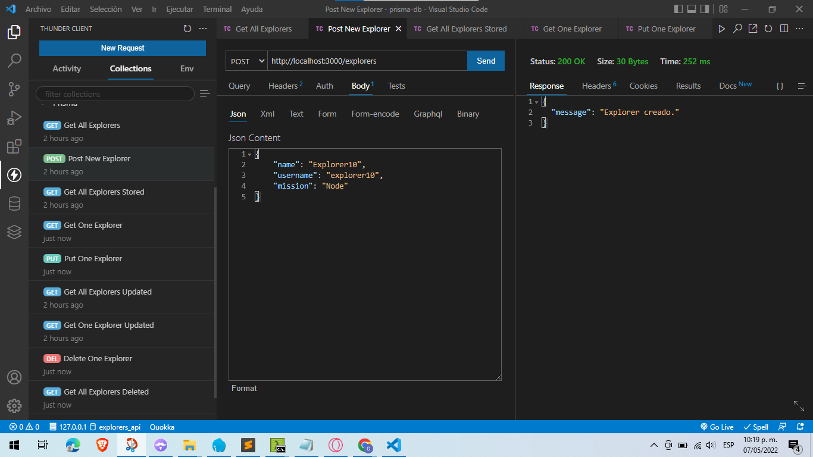

# Documentación

## Preparar proyecto

Iniciar proyecto en NodeJs `npm init -y`


Instalar paquetes `express` y `prisma`

```
npm install express --save-dev
npm install prisma --save-dev
```


Ignorar carpeta `node_modules` mediante el archivo `.gitignore`
```
**/node_modules
**/.env
```

Crear base de datos `create database explorers_api;`
Entrar a la base de datos `\c explorers_api;`
Ver tablas relacionadas `\d`


Iniciar configuración de prisma `npx prisma init`


Definir dirección del motor **PostgreSQL** en el archivo `.env`

```
DATABASE_URL=""
```

Definir modelo en `prisma/schema.prisma` para luego correr el comando `npx prisma migrate dev --name init` para crear una tabla.
```
// This is your Prisma schema file,
// learn more about it in the docs: https://pris.ly/d/prisma-schema

generator client {
  provider = "prisma-client-js"
}

datasource db {
  provider = "postgresql"
  url      = env("DATABASE_URL")
}


model Explorer {
  id Int @id @default(autoincrement())
  name String @unique
  username String @db.VarChar(255)
  mission String @db.VarChar(255)
  azureCertification Boolean @default(false)
  dateCreated DateTime @default(now())
  lastUpdated DateTime @updatedAt
}
```


Crear archivo con el nombre `seed.js` dentro de la carpeta prisma para llenar la base de datos y correr el comando `node prisma/seed.js`
```
const { PrismaClient } = require("@prisma/client");
const prisma = new PrismaClient();

(async function main() {
  try {
    const woopa = await prisma.explorer.upsert({
      where: { name: "Woopa" },
      update: {},
      create: {
        name: "Woopa",
        username: "ajolonauta",
        mission: "Node",
      },
    });

    const woopa1 = await prisma.explorer.upsert({
      where: { name: "Woopa1" },
      update: {},
      create: {
        name: "Woopa1",
        username: "ajolonauta1",
        mission: "Node",
      },
    });

    const woopa2 = await prisma.explorer.upsert({
      where: { name: "Woopa 2" },
      update: {},
      create: {
        name: "Woopa 2",
        username: "ajolonauta2",
        mission: "Java",
      },
    });

    const woopa3 = await prisma.explorer.upsert({
      where: { name: "Woopa 3" },
      update: {},
      create: {
        name: "Woopa 3",
        username: "ajolonauta3",
        mission: "Node",
      },
    });

    console.log("Create 3 explorers");
  } catch (e) {
    console.error(e);
    process.exit(1);
  } finally {
    await prisma.$disconnect();
  }
})();
```


Crear archivo `server.js` y correrlo mediante `node app.js`
```
const express = require("express");
const app = express();
app.use(express.json());
const port = process.env.PORT || 3000;

const { PrismaClient } = require("@prisma/client");
const prisma = new PrismaClient();

app.get("/", (req, res) => {
  res.json({ message: "alive" });
});

app.get("/explorers", async (req, res) => {
  const allExplorers = await prisma.explorer.findMany({});
  res.json(allExplorers);
});

app.get('/explorers/:id', async (req, res) => {
  const id = req.params.id;
  const explorer = await prisma.explorer.findUnique({where: {id: parseInt(id)}});
  res.json(explorer);
});

app.post('/explorers', async (req, res) => {
  const explorer = {
    name: req.body.name,
    username: req.body.username,
    mission: req.body.mission
   };
  const message = 'Explorer creado.';
  await prisma.explorer.create({data: explorer});
  return res.json({message});
});

app.put('/explorers/:id', async (req, res) => {
	const id = parseInt(req.params.id);

	await prisma.explorer.update({
		where: {
			id: id
		},
		data: {
			mission: req.body.mission
		}
	})

	return res.json({message: "Actualizado correctamente"});
});

app.delete('/explorers/:id', async (req, res) => {
	const id = parseInt(req.params.id);
	await prisma.explorer.delete({where: {id: id}});
	return res.json({message: "Eliminado correctamente"});
});

app.listen(port, () => {
  console.log(`Listening to requests on port ${port}`);
});

```


CRUD

CREATE



READ ALL 


READ ONE DATA


UPDATE


DELETE


## Crear tabla de estudiantes

1.- Crear modelo `student`

```
model Student {
  id Int @id @default(autoincrement())
  name String @unique
  lang String @db.VarChar(255)
  missionCommander String @db.VarChar(255)
  enrollments Int
  hasCertifi Boolean @default(false)
  dateCreated DateTime @default(now())
  lastUpdated DateTime @updatedAt
}
```

Migrar modelo a la base de datos `npx prisma migrate dev --name ini`

Crear archivo para rellenar datos a la tabla `Student` y correrlo mediante el comando `node studentSeed.js`
```
const { PrismaClient } = require("@prisma/client");
const prisma = new PrismaClient();

(async function main() {
  try {
    const woopa1 = await prisma.student.upsert({
      where: { name: "Woopa1" },
      update: {},
      create: {
        name: "Woopa1",
        lang: "javascript",
        missionCommander: "CarloGilmar",
        enrollments: 3
      },
    });

    const woopa2 = await prisma.student.upsert({
      where: { name: "Woopa2" },
      update: {},
      create: {
        name: "Woopa2",
        lang: "javascript",
        missionCommander: "CarloGilmar",
        enrollments: 5
      },
    });

    const woopa3 = await prisma.student.upsert({
      where: { name: "Woopa3" },
      update: {},
      create: {
        name: "Woopa3",
        lang: "java",
        missionCommander: "CarloGilmar",
        enrollments: 2
      },
    });

    const woopa4 = await prisma.student.upsert({
      where: { name: "Woopa4" },
      update: {},
      create: {
        name: "Woopa4",
        lang: "java",
        missionCommander: "CarloGilmar",
        enrollments: 1
      },
    });

    console.log("Create 4 students");
  } catch (e) {
    console.error(e);
    process.exit(1);
  } finally {
    await prisma.$disconnect();
  }
})();
```

Crear CRUD para la tabla `Student` en el archivo `server.js` y correrlo mediante `node server.js`
```
app.get("/students", async (req, res) => {
  const allStudents = await prisma.student.findMany({});
  res.json(allStudents);
});

app.get("/students/:id", async (req, res) => {
  const id = req.params.id;
  const student = await prisma.student.findUnique({
    where: { id: parseInt(id) },
  });
  res.json(student);
});

app.post("/students", async (req, res) => {
  const student = {
    name: req.body.name,
    lang: req.body.lang,
    missionCommander: req.body.missionCommander,
    erollments: req.body.erollments,
  };
  const message = "Estudiante creado con éxito";
  await prisma.student.create({ data: student });
  return res.json({ message });
});

app.put("/students/:id", async (req, res) => {
  const id = parseInt(req.params.id);

  await prisma.student.update({
    where: {
      id: id,
    },
    data: {
      mission: req.body.mission,
    },
  });

  return res.json({ message: "Estudiante modificado con éxito" });
});

app.delete("/students/:id", async (req, res) => {
  const id = parseInt(req.params.id);
  await prisma.student.delete({ where: { id: id } });
  return res.json({ message: "Estudiante eliminado con éxito" });
});
```

CRUD

CREATE A STUDENT


READ ALL STUDENTS


READ A STUDENT


UPDATE A STUDENT


DELETE A STUDENT

